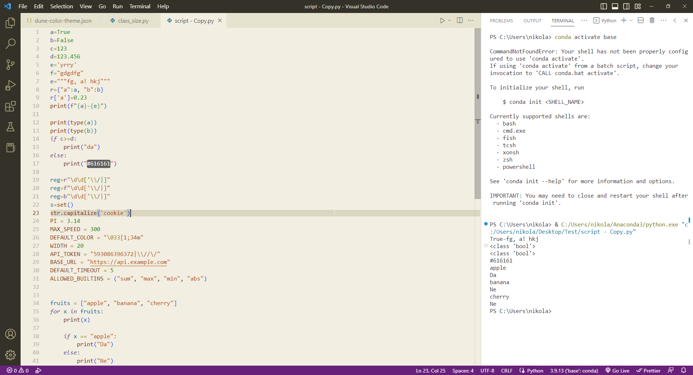
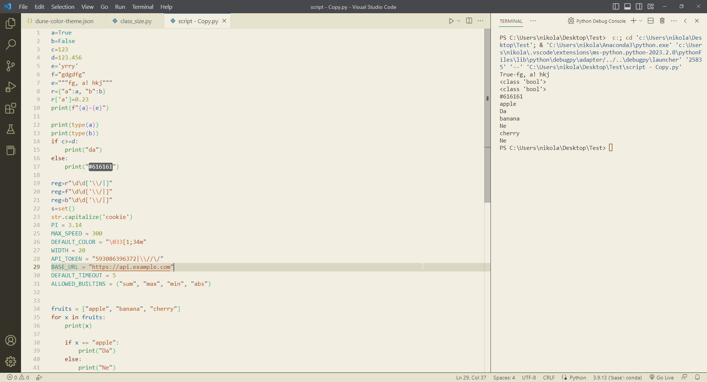
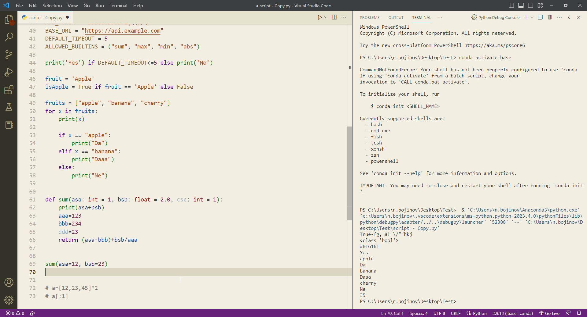

# Dune

Color theme for Visual Studio Code inspired by Adobe Brackets.
The main goal of this theme is to be easy on eyes on low brightness monitor.

## Syntax Palette

| Scope                | Color                                            | HEX     |
| -------------------- | ------------------------------------------------ | ------- |
| Background           |  | #e5e2ce |
| Foreground           |  | #3c3f41 |
| Comment              |  | #a0a1a7 |
| Keyword              |  | #771407 |
| Function/Method      |  | #1e8d3c |
| Property             |  | #923821 |
| String               |  | #b04b10 |
| Number               |  | #89990e |
| Variable             |  | #046099 |
| Constant             |  | #058f8d |
| Class/Type/Interface |  | #bd7521 |
| Operator/Punctuation |  | #616161 |

## Screenshots

## Installation
[Where are extensions installed?](https://code.visualstudio.com/docs/editor/extension-marketplace#_where-are-extensions-installed)
**Windows** %USERPROFILE%\.vscode\extensions   
**macOS** ~/.vscode/extensions   
**Linux** ~/.vscode/extensions   

[doc](https://vscode-docs1.readthedocs.io/en/latest/getstarted/theme-color-reference/?q=panelTitle.activeBorder&check_keywords=yes&area=default)

## License

This theme is released under the [MIT License](https://github.com/vislupus/Dune/blob/main/LICENSE).

